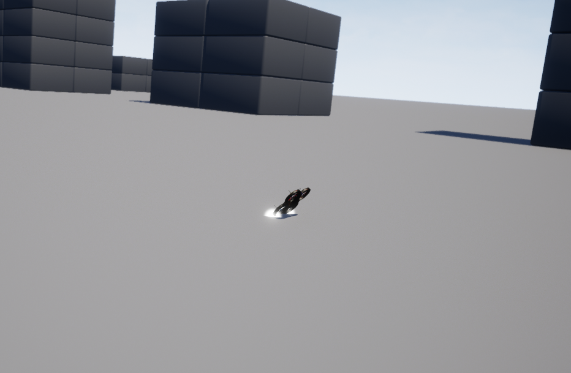

# Description

When reaching the first way point, a gyro fail is manually triggered. causing imidiate anomaly in the drone's behavior. The drone continues to adjust its position but no help, eventually crashing into the ground in a back-flip.

## image


```text
INFO  [logger] Opened full log file: ./log/2024-07-22/22_17_51.ulg
INFO  [tone_alarm] home set
INFO  [tone_alarm] notify negative
INFO  [commander] Ready for takeoff!
INFO  [mavlink] partner IP: 127.0.0.1
INFO  [commander] Armed by external command
INFO  [tone_alarm] arming warning
INFO  [commander] Takeoff detected
WARN  [simulator_mavlink] CMD_INJECT_FAILURE, gyro 0 off
WARN  [simulator_mavlink] CMD_INJECT_FAILURE, gyro 1 off
WARN  [simulator_mavlink] CMD_INJECT_FAILURE, gyro 2 off
ERROR [health_and_arming_checks] angular velocity no longer valid (timeout)
WARN  [failsafe] Failsafe activated
INFO  [tone_alarm] battery warning (fast)
WARN  [health_and_arming_checks] Preflight Fail: No valid data from Gyro 0
WARN  [health_and_arming_checks] Preflight Fail: Flight termination active
INFO  [commander] Disarmed by lockdown
WARN  [health_and_arming_checks] Preflight Fail: No valid data from Gyro 0
WARN  [health_and_arming_checks] Preflight Fail: Flight termination active
INFO  [tone_alarm] notify neutral
INFO  [logger] closed logfile, bytes written: 5784076
```